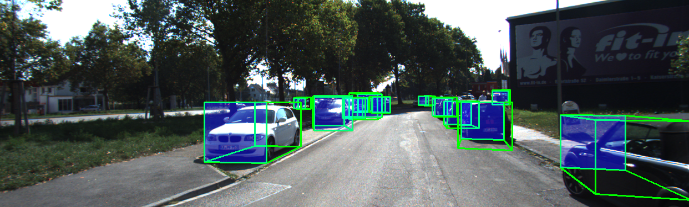
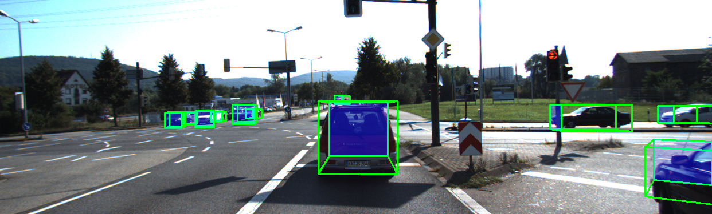
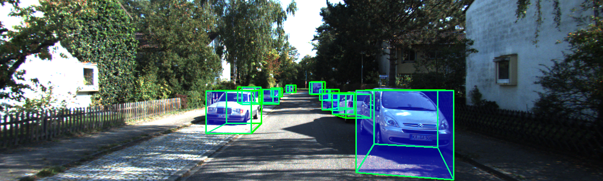

# OpenVINO and the Evolution of 3D Object Detection


## Overview

The move from 2D detection to robust 3D perception is a pivotal step for robotics, AR, and autonomy. This post reframes OpenVINO not simply as a performance engine, but as an ecosystem and enabler in the evolution of 3D object detection — helping projects move from research prototypes to reliable, maintainable deployments on Intel platforms.

We use the YOLO3D project (originally at `ruhyadi/YOLO3D`) and a  OpenVINO  API as a concrete case study to show how the OpenVINO stack supports interoperability, model lifecycle, multimodal fusion, and field-ready deployment practices that matter for robotics and systems engineering.

**Outline**

- **Interoperability & Portability**: Using ONNX and OpenVINO IR conversion tooling to keep research and deployment decoupled.
- **Tooling & Numeric Stability**: Calibration, quantization, and deterministic kernels for spatial accuracy.
- **Deployment Patterns**: Fallback APIs, sensor fusion, and field calibration workflows.
- **Case Study**: Applying these ideas to `ruhyadi/YOLO3D` with an OpenVINO fallback.
- **Practical Recommendations & Next Steps**: CI checks, calibration datasets, and multi‑sensor support.

## Why Evolution Matters More Than Raw Performance

Robotics teams face several non‑performance barriers when adopting 3D perception:
- Sensor and data heterogeneity (lidar, stereo, RGB‑D)
# OpenVINO-First 3D Perception for Robotics

## TL;DR

OpenVINO is the primary deployment artifact for 3D perception in robotics: convert checkpoints directly to OpenVINO IR, validate geometry/quantization with a small calibration set, and deploy the IR to edge devices. This short guide condenses the practical steps we used to move a YOLO3D pipeline into a production-ready flow.

**Note:** Leading voices in AI are now explicitly moving into 3D perception. See this talk for context: https://www.youtube.com/watch?v=y8NtMZ7VGmU — the so-called "godmother of AI" outlines why spatial understanding is the next frontier. This shift reinforces our focus: reliable, geometry-preserving deployment (via OpenVINO IR) is critical for robotics and real-world systems.

## Why OpenVINO-First for Robotics


## Minimal OpenVINO-First Workflow

1. Export or keep your trained PyTorch checkpoint (`.pt`).
2. Convert to OpenVINO IR with `ovc` or `convert_model()`.
3. Validate numeric and geometric correctness on a calibration set.
4. Deploy IR and run with OpenVINO Core.

Conversion examples (recommended):

```
# CLI: convert PyTorch checkpoint to OpenVINO IR (FP16)
ovc --framework pytorch --input_model weights/yolov5s.pt --output_dir weights/openvino --precision FP16
```

```
# Python API: convert_model()
from openvino.model_conversion import convert_model

convert_model(
	model='weights/yolov5s.pt',
	output_dir='weights/openvino',
	precision='FP16',
	framework='pytorch'
)
```

## OpenVINO-First Inference Wrapper

Make OpenVINO the primary runtime in your stack. Provide a small wrapper that loads an IR and exposes a `predict()` API; fall back to a developer runtime only for local debugging.

```
from openvino.runtime import Core

class OVModel:
	def __init__(self, ir_xml):
		core = Core()
		model = core.read_model(ir_xml)
		self.compiled = core.compile_model(model, device_name='CPU')

	def predict(self, input_numpy):
		return self.compiled(input_numpy)
```

Use this wrapper inside the 3D pipeline so that camera calibration and geometric postprocessing receive consistent outputs across devices.

## What to Check for 3D Models

- Preserve camera matrices and calibration files (e.g. `dataset/KITTI/calib_cam_to_cam.txt`).
- Validate regression outputs (orientation, dimensions) after conversion using per-channel calibration data.
- Capture end-to-end plots/visuals as part of CI to catch geometric regressions early.

## Example: running a regressor IR with OpenVINO

```
from openvino.runtime import Core
core = Core()
regressor = core.read_model('weights/openvino/resnet18.xml')
compiled = core.compile_model(regressor, 'CPU')
res = compiled(input_tensor.numpy())
orient = res[compiled.output(0)]
conf = res[compiled.output(1)]
dim = res[compiled.output(2)]
```

## KITTI example outputs

These images show 3D boxes after conversion and inference using the workflow above.







## Short Recommendations

- Version the IR and treat it as the deployable binary.
- Use `ovc` or `convert_model()` for conversion
- Add a small calibration validation step in CI that checks coordinates and orientation tolerances.


## Closing — The 3D Moment

The field is moving into 3D. Leaders in AI are already pointing to spatial understanding as the next frontier, and robotics teams must respond by making perception predictable and deployable. An OpenVINO-first workflow — convert, validate on a calibration set, and ship IR artifacts — turns research models into dependable robot behavior. Test on your sensors, share failure cases, and help build practical calibration suites that make 3D perception reliable in the real world.


